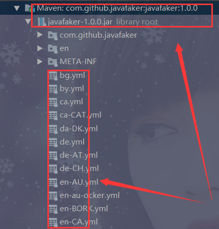

<h1>Java Faker 生成随机数</h1>

<h1>一、官网</h1>

<span>官网 : </span><a href='http://paraseba.github.io/faker/'>http://paraseba.github.io/faker/</a>

<h1>二、maven 依赖</h1>

```xml
        <!-- https://mvnrepository.com/artifact/com.github.javafaker/javafaker -->
        <dependency>
            <groupId>com.github.javafaker</groupId>
            <artifactId>javafaker</artifactId>
            <version>1.0.0</version>
        </dependency>
```

<h1>三、包含的领域</h1>

<pre><code>
在包：com.github.javafaker 下面有包含的领域
</code></pre>

<ol>
<li>金融 - faker.finance()</li>
<li>书籍 - faker.book()</li>
<li>商务 - faker.business()</li>
<li>地址 - faker.address()</li>
<li>姓名 - faker.name()</li>
<li>等等...</li>
</ol>

<h1>四、编码</h1>

<pre><code>
默认是英文编码，如果想使用中文可以使用:
Faker faker = new Faker(new Locale("zh-CN"));
</code></pre>

其他编码：定位到 faker 源码，选择对应的 yml 文件就好了<br />


<h1>五、使用示例</h1>


